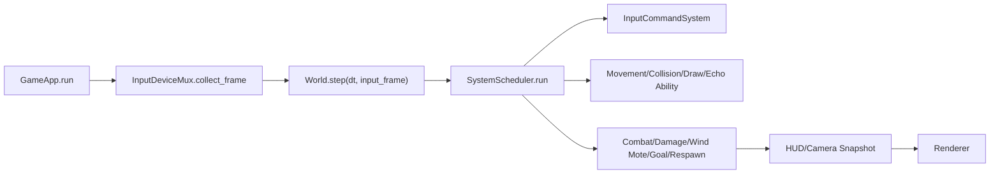
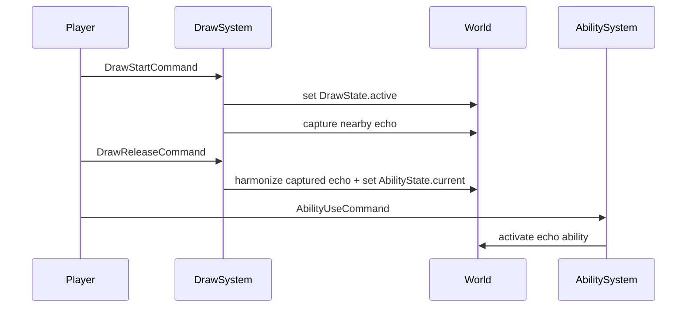

# Windsprig 아키텍처 다이어그램

## 1) 런루프 (Facade -> ECS)

```mermaid
flowchart LR
  A["GameApp.run"] --> B["InputDeviceMux.collect_frame"]
  B --> C["World.step(dt, input_frame)"]
  C --> D["SystemScheduler.run"]
  D --> E["InputCommandSystem"]
  D --> F["Movement/Collision/Draw/Echo Ability"]
  D --> G["Combat/Damage/Wind Mote/Goal/Respawn"]
  G --> H["HUD/Camera Snapshot"]
  H --> I["Renderer"]
```

## 2) 입력 -> 명령 -> 의도

```mermaid
flowchart LR
  A["Keyboard/Pads"] --> B["InputDeviceMux"]
  B --> C["InputFrame{slot -> commands}"]
  C --> D["InputCommandSystem"]
  D --> E["ControlIntent Component"]
  E --> F["Movement/Draw/Echo Ability Systems"]
```

## 3) Draw/포획/하모나이즈 시퀀스

```mermaid
sequenceDiagram
  participant P as Player
  participant DS as DrawSystem
  participant W as World
  participant AS as AbilitySystem

  P->>DS: DrawStartCommand
  DS->>W: set DrawState.active
  DS->>W: capture nearby echo
  P->>DS: DrawReleaseCommand
  DS->>W: harmonize captured echo + set AbilityState.current
  P->>AS: AbilityUseCommand
  AS->>W: activate echo ability
```
